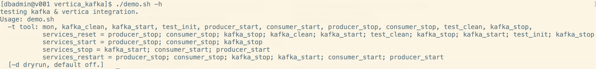
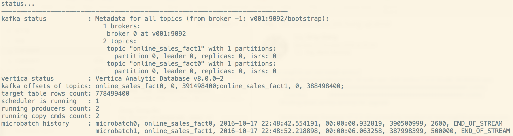

<html lang="zn_CN"> <head> <meta charset='utf-8'> <title>Vertica and Kafka Integration Demo</title> </head> <body>

Vertica and Kafka integration demo
==========
This is simple CLI demo, *demo.sh*, for integraton between Vertica and Kafka.

It provide some "tools" to startup/stop kafka cluster, config Vertica microbatch, start/stop producer/consumer, and monitor.

 * -t toolName
 * -d . just show the commands, will not run them really. 

./demo.sh -t help
----------

./demo.sh -t mon
----------

</body> </html>

